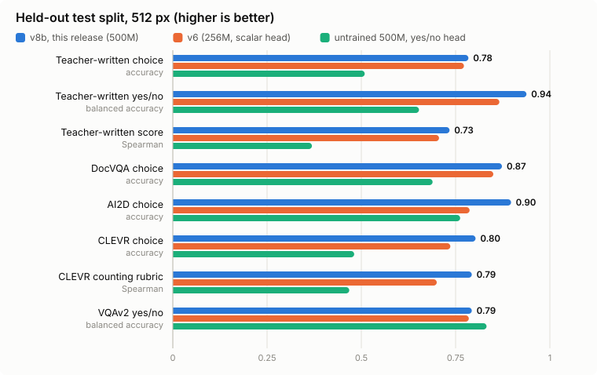
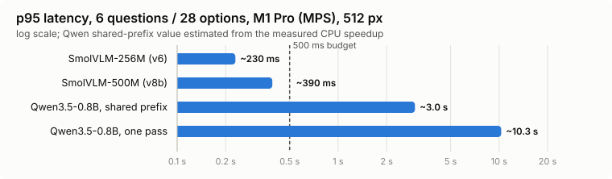

# peekaboolean

*Peek at an image, get booleans back* (and choices, and scores).

A small vision-language model that answers typed questions about an image, fast enough
for a laptop. You send one image, a `state` (context) and any number of named
questions. Each question is one of three types:

- **choice**: pick one of the options you supply, each with its own description
- **score**: place the image on an ordinal rubric you supply (any number of levels)
- **noul**: yes/no, returned as a probability

The model never generates text. It scores the options the caller wrote, so it only
returns answers you asked for, the probabilities are calibrated, and a rubric the model
never saw in training works as well as a familiar one.

- Backbone: [SmolVLM-500M-Instruct](https://huggingface.co/HuggingFaceTB/SmolVLM-500M-Instruct),
  LoRA on the language model, vision tower frozen
- Head: the backbone's own `logit(Yes) − logit(No)` for "is this proposed answer correct?"
- Training: distilled from Qwen3-VL-30B-A3B (a local teacher that wrote and labelled
  requests) plus public VQA data
- Latency: about 400 ms p95 for a six-question request (28 options) on an M1 Pro
  (MPS, 512 px); about 60 ms on a desktop GPU
- Weights: `bykof/peekaboolean-500m` (CC BY-NC 4.0, see [Licence](#licence))

How it was built and what did and did not work: [docs/REPORT.md](docs/REPORT.md).

## Quickstart

```bash
git clone https://github.com/bykof/peekaboolean && cd peekaboolean
uv sync --python 3.13
uv run python -m peekaboolean.serve --adapter bykof/peekaboolean-500m \
  --image photo.jpg --request requests/general.json --max-edge 512
```

Without Hugging Face, take the same weights from the GitHub release:

```bash
curl -L https://github.com/bykof/peekaboolean/releases/download/v0.1.0/peekaboolean-500m.tar.gz | tar xz
uv run python -m peekaboolean.serve --adapter peekaboolean-500m --image photo.jpg --request requests/general.json --max-edge 512
```

`--adapter` takes a Hub repo id or a local checkpoint directory. The base model and
adapter download on first use. `--device` picks `cuda`, `mps` or `cpu` (default: auto).

A request (`requests/general.json`):

```json
{
  "state": "Answer using only what is visible in the image.",
  "questions": {
    "kind": {
      "type": "choice",
      "instructions": "What kind of image is this?",
      "criteria": {
        "photo": "A photograph of a real scene",
        "screenshot": "An application or website screenshot",
        "document": "A scanned or photographed document page",
        "chart": "A chart, graph, or diagram"
      }
    },
    "sharpness": {
      "type": "score",
      "instructions": "How sharp is the image?",
      "criteria": [
        "very blurry",
        "somewhat blurry",
        "acceptable",
        "sharp"
      ]
    },
    "person_visible": {
      "type": "noul",
      "instructions": "Is a person visible in the image?"
    }
  }
}
```

The answer for a chart image:

```json
{
  "answers": {
    "kind": {"type": "choice", "choice": "chart", "confidence": 0.755,
             "probabilities": {"photo": 0.0002, "screenshot": 0.180, "document": 0.004, "chart": 0.817}},
    "sharpness": {"type": "score", "score": 1.96, "confidence": 0.151,
                  "probabilities": {"0": 0.114, "1": 0.176, "2": 0.346, "3": 0.363},
                  "legend": {"0": "very blurry", "1": "somewhat blurry", "2": "acceptable", "3": "sharp"}},
    "person_visible": {"type": "noul", "noul": 0.047}
  }
}
```

`score` is the expected level index (0 = first level). `noul` is P(yes).

From Python, load once and reuse:

```python
from peekaboolean.serve import load, evaluate
model, processor, calibration = load("bykof/peekaboolean-500m", device="mps", merge=True)
result = evaluate(model, processor, state, questions, "photo.jpg", calibration, max_edge=512)
```

`state`, `instructions` and every option may be a string, an object or a list. Noul
questions may carry their own wording: `"criteria": {"true": "...", "false": "..."}`.
Each question is scored independently, so answers do not depend on option order or on
the other questions in the request.

### Serving modes

`--mode` (default `auto`); all return the same answers in fp32:

- `shared`: encode image and state once, then score every option as a suffix against
  the KV cache
- `single`: everything in one forward pass; faster for small requests on MPS
- `auto`: `single` up to 8 options, `shared` above
- `naive`: one forward pass per question; the reference path

`serve --check` asserts that the three agree. `python -m peekaboolean.benchmark` measures warm
latency per image size and request shape (`--breakdown` for per-stage times).

Calibration temperatures were fitted separately for 256, 384 and 512 px. Serve at
512 px unless latency forces a smaller size.

## Results

<picture>
  <source media="(prefers-color-scheme: dark)" srcset="docs/img/quality-dark.svg">
  
</picture>

<picture>
  <source media="(prefers-color-scheme: dark)" srcset="docs/img/latency-dark.svg">
  
</picture>

Held-out test split, 512 px. Image splits are by content hash, so no test image was
seen in training. "Teacher" groups are requests written by the teacher model and
measure agreement with the teacher, not with ground truth.

| Group | untrained 500M (yes/no head) | v6 (256M, scalar head) | **v8b (this release)** |
| --- | --- | --- | --- |
| teacher choice, accuracy | 0.51 | 0.77 | **0.78** |
| teacher noul, balanced accuracy | 0.65 | 0.87 | **0.94** |
| teacher score, Spearman | 0.37 | 0.71 | **0.73** |
| VQAv2 choice / noul | 0.73 / 0.83 | 0.91 / 0.79 | **0.91 / 0.79** |
| DocVQA / ChartQA / TextVQA choice | 0.69 / 0.60 / 0.85 | 0.85 / 0.86 / 0.96 | **0.87 / 0.87 / 0.96** |
| AI2D / CLEVR choice | 0.76 / 0.48 | 0.79 / 0.74 | **0.90 / 0.80** |
| counting rubrics VQAv2 / CLEVR, Spearman | 0.44 / 0.47 | 0.79 / 0.70 | **0.79 / 0.79** |
| FairFace age (10 bins), Spearman | – | – | **0.81** |
| FairFace "is this a child" / gender, balanced accuracy | – | – | **0.97 / 0.96** |

The untrained column comes from a 4,000-row validation sample. v6 is measured on its own
(v6) test split, v8b on the full v7/v8 test split (21k questions); both use the same image
splits. Per-group JSON reports are attached to the GitHub release.

Mac latency (M1 Pro, MPS, fp32, `--mode auto`, 512 px): a six-question request with 28
options measured about 380–400 ms p95 for the 500M backbone. The 256M v6 model: 116 ms
for one noul, 230 ms for the six-question request.

## Limitations

- Accuracy against the teacher is not accuracy against people. There is no public
  human-labelled acceptance set for request-shaped questions yet.
- Photo aesthetics were dropped from training in v7; the model's aesthetic scores are
  no better than a text-only prior.
- The model estimates age, gender and "child or adult" from faces (FairFace training).
  These estimates carry the biases of the data and are wrong for individual people
  often enough that they must not be used to decide anything about a person. It also
  answers such questions for drawings and cartoon characters.
- Options are scored independently, so the model cannot compare options that differ
  only by contrast ("the larger one").

## Training your own

Everything that produced this checkpoint is in `src/peekaboolean`. The pipeline, in order:

1. `prepare_general.py`: typed questions from [The Cauldron](https://huggingface.co/datasets/HuggingFaceM4/the_cauldron)
   (VQAv2, CLEVR, TextVQA, DocVQA, ChartQA, Screen2Words, AI2D), training partitions only
2. `prepare_teacher.py`: a local Qwen3-VL-30B-A3B (vLLM) writes one request per image
   and labels it (see the module docstring; runs in its own vLLM environment)
3. `prepare_v6.py`: mixes public and teacher rows, adds counting rubrics, tempers the
   teacher's probabilities against rows with known answers
4. `prepare_age.py`: FairFace age, gender and child/adult questions
5. `pipeline.py`: `train_general.py` → per-size calibration and test report
   (`postprocess.py`) → latency benchmark, as detached background jobs
6. `full_test.py`: score a checkpoint on every row of a test split

The exact settings for each version are in [docs/REPORT.md](docs/REPORT.md). All runs
used one RTX PRO 6000 (96 GB).
`docs/legacy-qwen-v1-v2.md` describes the earlier Qwen3-VL-4B aesthetics experiments
(`train.py`, `prepare_ava.py`, `prepare_aadb.py`, ...).

## Licence

- Code: Apache-2.0 ([LICENSE](LICENSE))
- Weights: CC BY-NC 4.0. The base model and the teacher are Apache-2.0, but some
  training data only allows research use (DocVQA; AVA and AADB images, which the
  teacher wrote questions about) or carries GPL-3.0 (ChartQA). The weights are
  therefore released for research and non-commercial use. Details are in the
  model card.

## Citation

See [CITATION.cff](CITATION.cff).
