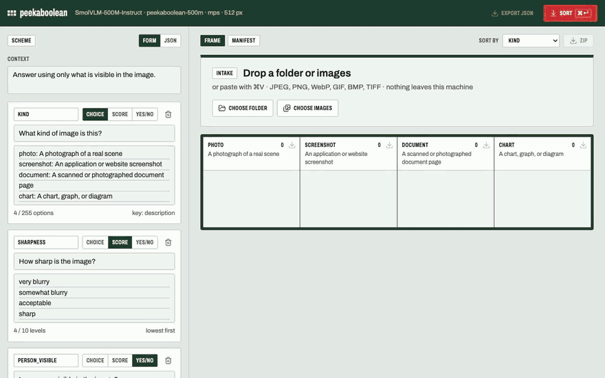
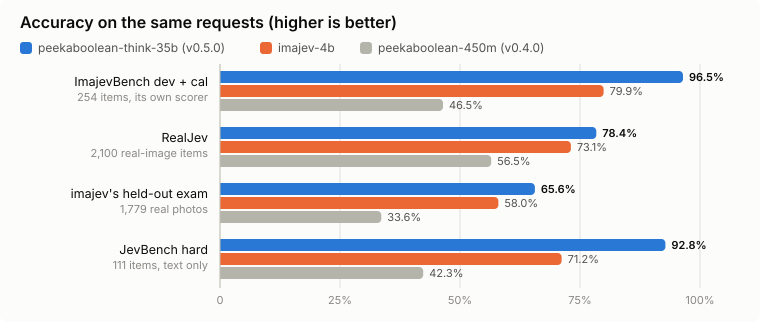
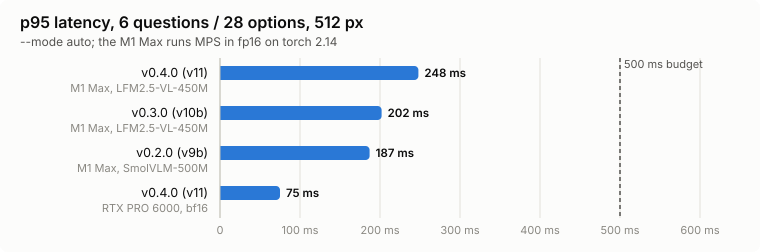
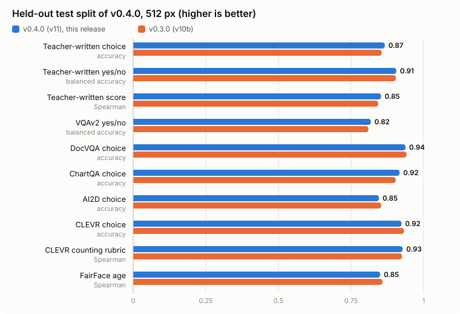

# peekaboolean

*Peek at an image, get booleans back* (and choices, and scores).

A small vision-language model that answers typed questions about an image, fast enough
for a laptop. You send one image, a `state` (context) and any number of named
questions. Each question is one of three types:

- **choice**: pick one of the options you supply, each with its own description
- **score**: place the image on an ordinal rubric you supply (any number of levels)
- **noul**: yes/no, returned as a probability

The model never generates text. It scores the options the caller wrote, so it only
returns answers you asked for, the probabilities are calibrated, and a rubric the model
never saw in training works as well as a familiar one.

- Backbone: [LFM2.5-VL-450M](https://huggingface.co/LiquidAI/LFM2.5-VL-450M), LoRA on the
  language model, vision tower frozen (v0.2.0 and earlier: SmolVLM-500M-Instruct)
- Head: the backbone's own `logit(Yes) − logit(No)` for "is this proposed answer correct?"
- Training: distilled from two local teachers plus public VQA data. Qwen3.6-35B-A3B
  wrote and labelled requests, and Qwen3-VL-30B-A3B labelled them again.
- Can't tell: every answer carries `unknown_probability` and `abstained`, from a trained
  candidate "It cannot be determined from the image and the given information." (new in v0.4.0)
- Latency: 248 ms p50 (264 ms p95) for a six-question request (28 options) on an M1 Max
  (MPS, fp16, torch 2.14, 512 px); 75 ms p95 on an RTX PRO 6000. Not re-measured on an
  M1 Pro: there v0.1.0 took about 400 ms p95 in fp32 on torch 2.11, against 327 ms on the M1 Max
- Weights: [GitHub release v0.4.0](https://github.com/bykof/peekaboolean/releases/tag/v0.4.0) and
  [bykof/peekaboolean-450m](https://huggingface.co/bykof/peekaboolean-450m) (CC BY-NC 4.0, see [Licence](#licence));
  earlier checkpoints stay at [v0.3.0](https://github.com/bykof/peekaboolean/releases/tag/v0.3.0) (no can't-tell,
  20% faster), [v0.2.0](https://github.com/bykof/peekaboolean/releases/tag/v0.2.0) and
  [v0.1.0](https://github.com/bykof/peekaboolean/releases/tag/v0.1.0)
- Jev: the request format is TypeSafe's [Jev](https://docs.typesafe.ai/models) with an image; the local
  server also answers `POST /v1/systemone`

How it was built and what did and did not work: [docs/REPORT.md](docs/REPORT.md).

**v0.5.0 adds a second, large model: [peekaboolean-think-35b](think/README.md).** Same request and response, but it
reasons before it answers: Qwen3.6-35B-A3B with a LoRA, reading the option probabilities from the answer letter
after the reasoning. It is far more accurate than the 450M model and than imajev-4b ([results](#v050-peekaboolean-think-35b)),
and far slower: about a minute per six-question request on a GPU. It runs on a 64 GB Mac in 8-bit MLX. Weights:
[release v0.5.0](https://github.com/bykof/peekaboolean/releases/tag/v0.5.0),
[bykof/peekaboolean-think-35b](https://huggingface.co/bykof/peekaboolean-think-35b) (adapter) and
[bykof/peekaboolean-think-35b-mlx-8bit](https://huggingface.co/bykof/peekaboolean-think-35b-mlx-8bit) (Mac).
Report: [docs/think-35b.md](docs/think-35b.md).

## Quickstart

```bash
git clone https://github.com/bykof/peekaboolean && cd peekaboolean
uv sync --python 3.13
curl -L https://github.com/bykof/peekaboolean/releases/download/v0.4.0/peekaboolean-450m.tar.gz | tar xz
uv run python -m peekaboolean.serve --adapter peekaboolean-450m \
  --image photo.jpg --request requests/general.json --max-edge 512
```

`--adapter` takes a local checkpoint directory or a Hugging Face repo id
(`--adapter bykof/peekaboolean-450m` skips the download above). The base model downloads on
first use. `--device` picks `cuda`, `mps` or `cpu` (default: auto). On MPS the model runs in
fp16: on the 42 demo images, answers moved by at most 0.006 against CPU fp32 and none changed.
`--check` runs in fp32.

A request (`requests/general.json`):

```json
{
  "state": "Answer using only what is visible in the image.",
  "questions": {
    "kind": {
      "type": "choice",
      "instructions": "What kind of image is this?",
      "criteria": {
        "photo": "A photograph of a real scene",
        "screenshot": "An application or website screenshot",
        "document": "A scanned or photographed document page",
        "chart": "A chart, graph, or diagram"
      }
    },
    "sharpness": {
      "type": "score",
      "instructions": "How sharp is the image?",
      "criteria": [
        "very blurry",
        "somewhat blurry",
        "acceptable",
        "sharp"
      ]
    },
    "person_visible": {
      "type": "noul",
      "instructions": "Is a person visible in the image?"
    }
  }
}
```

The answer for a chart image:

```json
{
  "answers": {
    "kind": {"type": "choice", "choice": "chart", "confidence": 0.755,
             "probabilities": {"photo": 0.0002, "screenshot": 0.180, "document": 0.004, "chart": 0.817}},
    "sharpness": {"type": "score", "score": 1.96, "confidence": 0.151,
                  "probabilities": {"0": 0.114, "1": 0.176, "2": 0.346, "3": 0.363},
                  "legend": {"0": "very blurry", "1": "somewhat blurry", "2": "acceptable", "3": "sharp"}},
    "person_visible": {"type": "noul", "noul": 0.047}
  }
}
```

`score` is the expected level index (0 = first level). `noul` is P(yes).

Since v0.4.0 every answer also carries `unknown_probability`, the mass on the trained can't-tell
candidate, and `abstained`, true when that mass beats every option. `probabilities` are then the
distribution given that the image answers the question, and `noul` is P(yes) +
`unknown_probability` / 2, Jev's convention. Adapters without `"unknown": true` in
`scorer_config.json` (v0.3.0 and earlier) leave both fields out, and `/v1/systemone` reports them
as 0 and false.

From Python, load once and reuse:

```python
from peekaboolean.serve import load, evaluate
model, processor, calibration = load("peekaboolean-450m", device="mps", merge=True)
result = evaluate(model, processor, state, questions, "photo.jpg", calibration, max_edge=512)
```

`state`, `instructions` and every option may be a string, an object or a list. Noul
questions may carry their own wording: `"criteria": {"true": "...", "false": "..."}`.
Each question is scored independently, so answers do not depend on option order or on
the other questions in the request.

### Local UI

```bash
uv run python -m peekaboolean.ui --adapter peekaboolean-450m
```

Opens a page on http://127.0.0.1:8765. Drop a folder or images on it (or choose them,
or paste), write the questions, press Sort (⌘↵). Each image lands in the bin of its
answer; the manifest lists every answer with its probabilities, and Export JSON saves
`{request, results, errors}`. Choice options are one per line as `key: description`,
score levels one per line lowest first, yes/no wording optional as `yes: …` / `no: …`.
The JSON view edits the same request in the format above. Images stay on the machine.

The same server answers `POST /v1/systemone`: TypeSafe's Jev request with the `images`
extension that [imajev](https://github.com/mohit67890/imajev) and its ImajevBench harness use
(data URLs or base64, one image here), in Jev's `{model, answers, usage}` envelope:

```bash
curl -s http://127.0.0.1:8765/v1/systemone -H 'Content-Type: application/json' \
  -d "{\"state\": \"\", \"questions\": {\"person\": {\"type\": \"noul\", \"instructions\": \"Is a person visible?\"}},
       \"images\": [\"data:image/jpeg;base64,$(base64 < photo.jpg | tr -d '\n')\"]}"
```



Real time with v0.4.0 on an M1 Max (MPS, fp16, 512 px): 42 images from Wikimedia Commons with
the three questions of `requests/general.json` (the page's default) sort in 6.7 s, 154 ms of
model time each. The same images, authors and licences are listed in
[docs/demo-images.tsv](docs/demo-images.tsv); fetch them and drop `data/demo` on the page:

```bash
mkdir -p data/demo && tail -n +2 docs/demo-images.tsv | while IFS=$'\t' read -r file url _; do
  curl -sSfL -A "peekaboolean-demo (https://github.com/bykof/peekaboolean)" -o "data/demo/$file" "$url"; done
```

### Serving modes

`--mode` (default `auto`); all return the same answers in fp32:

- `tree`: the whole request as one packed sequence under a tree mask: image and state
  once, each question's text once, then each option's own tokens. Plain-attention
  backbones only (SmolVLM, InternVL)
- `shared`: encode image and state once, then score every option as a suffix against
  the KV cache
- `single`: everything in one forward pass; faster for small requests on MPS
- `auto`: `tree` where the backbone allows it; otherwise `single` for the smallest
  requests and `shared` above
- `naive`: one forward pass per question; the reference path

On an M1 Max (MPS, fp16, torch 2.14, 512 px), request6 on v0.2.0's SmolVLM takes 182 ms
p50 through `tree` against 240 ms through `shared`. LFM2.5-VL (v0.3.0 and later) has short-convolution
layers, so `auto` scores request6 through `shared` there: 201 ms p50 for v0.3.0, 248 ms for v0.4.0,
which scores one more candidate per question.

`serve --check` asserts that the three agree. `python -m peekaboolean.benchmark` measures warm
latency per image size and request shape (`--breakdown` for per-stage times).

Calibration temperatures were fitted separately for 256, 384 and 512 px. Serve at
512 px unless latency forces a smaller size.

## Results

### v0.5.0: peekaboolean-think-35b

peekaboolean-think-35b, imajev-4b (run by us as shipped: its server, 4 option rotations, its calibration file) and
v0.4.0 got the same requests on the same server.

<picture>
  <source media="(prefers-color-scheme: dark)" srcset="docs/img/quality-dark.svg">
  
</picture>

| Benchmark | **think-35b (v0.5.0)** | imajev-4b | 450m (v0.4.0) |
| --- | --- | --- | --- |
| ImajevBench v2.0-lite, dev + calibration (254 items, its own scorer) | **245 (96.5%)** | 203 (79.9%) | 118 (46.5%) |
| RealJev: 2,100 human-labelled real-image items from 8 public sets | **78.4%** | 73.1% | 56.5% |
| imajev's held-out real-photo exam (its own converters, 1,779 items) | **65.6%** | 58.0% | 33.6% |
| JevBench public hard / original / easy (text only, its own harness) | **103 / 72 / 48** | 79 / 71 / 48 | 47 / 36 / 35 |
| ECE on RealJev / held-out exam, with `calibration.json` | **0.038 / 0.055** | 0.080 / 0.072 | 0.075 / 0.115 |

- **Against imajev-4b:** +5.3 points on RealJev [+3.5, +7.1] and +7.6 on the held-out exam [+5.1, +10.3]
  (paired, group bootstrap). It loses on image-quality scoring (LIVE, 32.5% against 57.2%) and POPE adversarial (−4.0).
- **v0.4.0** takes one image, so the 80 two-image RealJev items and the 179 two-image exam items count as wrong.
- **What it costs:** request6 takes about a minute on one GPU (four reasoning samples per question), against 75 ms for
  the 450M model. On an M1 Max the 8-bit MLX model scores the ImajevBench calibration split 76/81, as on the GPU.
- **Details:** [docs/think-35b.md](docs/think-35b.md): method, every table, calibration, the Qwen3.8-27B attempt and
  the limitations.

<picture>
  <source media="(prefers-color-scheme: dark)" srcset="docs/img/latency-dark.svg">
  
</picture>

### v0.4.0

v0.4.0 (v11) against v0.3.0 (v10b). Both models are scored on the same rows: the held-out test
split of v0.4.0's mixture, 512 px, 31,000 questions (v0.2.0's test split plus the new teacher
rows). Image splits are by content hash, so no test image was seen in training.

<picture>
  <source media="(prefers-color-scheme: dark)" srcset="docs/img/quality-v0.4.0-dark.svg">
  
</picture>

| Group | v0.3.0 (v10b) | **v0.4.0 (v11)** |
| --- | --- | --- |
| teacher choice / noul / score (acc. / bal. acc. / Spearman) | 0.86 / 0.90 / 0.84 | **0.87 / 0.91 / 0.85** |
| VQAv2 choice / noul | 0.92 / 0.81 | 0.92 / 0.82 |
| DocVQA / ChartQA / TextVQA choice | 0.94 / 0.90 / 0.97 | 0.94 / 0.92 / 0.97 |
| AI2D / CLEVR / Screen2Words choice | 0.85 / 0.93 / 0.92 | 0.85 / 0.92 / 0.93 |
| counting rubrics VQAv2 / CLEVR, Spearman | 0.80 / 0.93 | 0.79 / 0.93 |
| FairFace age Spearman / child / gender | 0.86 / 0.98 / 0.97 | 0.85 / 0.98 / 0.97 |
| selection NLL (lower is better) | 0.460 | 0.462 |
| can't tell: abstains on the teachers' can't-tell questions, choice / noul / score | – | 79% / 30% / 84% |
| can't tell: abstains on the other teacher questions | – | 1.5% / 0.2% / 1.4% |
| ImajevBench v2.0-lite, dev + calibration (254 items) | 110 (43.3%) | **118 (46.5%)** |

- **What changed:** v11 is v0.3.0 fine-tuned with `--unknown` on v0.2.0's data plus 72,735 new
  teacher questions whose labels include a can't-tell option, with record and rule states.
- **Public groups** move by less than about one standard error.
- **Can't tell** works on questions like the ones the teachers could not answer: 367 choice, 67 noul
  and 229 score questions in the test split. On ImajevBench it still gets none of the 24 Unknown
  items, and its 11 abstentions there were all text-only items (see Limitations).
- **Latency:** 248 ms p50 per request6 on the M1 Max, against 201 ms for v0.3.0.
- **Details:** [docs/REPORT.md](docs/REPORT.md) §4.10 and the JSON reports attached to the release.

### v0.3.0

v0.3.0 (v10b) against v0.2.0 (v9b). Both models are scored on the same rows: the
held-out test split of v0.2.0, 512 px, 21,996 questions.

| Group | v0.2.0 (v9b) | **v0.3.0 (v10b)** |
| --- | --- | --- |
| teacher choice / noul / score (acc. / bal. acc. / Spearman) | 0.83 / 0.89 / 0.78 | **0.89 / 0.92 / 0.87** |
| VQAv2 choice / noul | 0.91 / 0.80 | 0.92 / 0.81 |
| DocVQA / ChartQA / TextVQA choice | 0.86 / 0.87 / 0.96 | **0.94 / 0.90** / 0.97 |
| AI2D / CLEVR / Screen2Words choice | 0.89 / 0.77 / 0.95 | 0.86 / **0.93** / 0.92 |
| counting rubrics VQAv2 / CLEVR, Spearman | 0.78 / 0.75 | 0.79 / **0.93** |
| FairFace age Spearman / child / gender | 0.81 / 0.97 / 0.96 | **0.86 / 0.98 / 0.97** |
| selection NLL (lower is better) | 0.507 | **0.424** |

- **Same data, new backbone.** v10b is v9b's data and recipe on LFM2.5-VL-450M.
- **Teacher groups** are requests written by Qwen3.6 and measure agreement with the
  teachers, not with ground truth.
- **Public groups** gain most on CLEVR (+16 points) and DocVQA (+8). AI2D (−2.4, n = 253)
  is about one standard error lower, and Screen2Words (−2.6, n = 386) about two.
- **Details:** training curves and the comparison with v9a are in
  [docs/newer-models-and-jev.md](docs/newer-models-and-jev.md) §3c. The JSON reports are
  attached to the release.

### v0.2.0

v0.2.0 (v9b) against v0.1.0 (v8b), on the same rows as above.

| Group | v0.1.0 (v8b) | **v0.2.0 (v9b)** |
| --- | --- | --- |
| teacher choice / noul / score (acc. / bal. acc. / Spearman) | 0.79 / 0.84 / 0.75 | **0.83 / 0.89 / 0.78** |
| the same, labelled by Qwen3-VL-30B-A3B alone | 0.78 / 0.82 / 0.72 | **0.82 / 0.88 / 0.74** |
| VQAv2 choice / noul | 0.91 / 0.79 | 0.91 / 0.80 |
| DocVQA / ChartQA / TextVQA choice | 0.87 / 0.88 / 0.97 | 0.86 / 0.87 / 0.96 |
| AI2D / CLEVR choice | 0.91 / 0.80 | 0.89 / 0.77 |
| counting rubrics VQAv2 / CLEVR, Spearman | 0.79 / 0.78 | 0.78 / 0.75 |
| FairFace age Spearman / child / gender | 0.81 / 0.97 / 0.96 | 0.81 / 0.97 / 0.96 |

- **Teacher groups** are requests written by Qwen3.6 and measure agreement with the
  teachers, not with ground truth. The second row grades both models against the
  labeller v8b was trained on, so v9b's gain does not come from grading against its own
  labels. The question style, though, is the one v9b trained on.
- **Public groups** are equal within noise. The largest drops, CLEVR (n = 603) and AI2D
  (n = 253), are about one standard error.
- **Details:** how the data was made and the per-group numbers are in
  [docs/alternative-backbones.md](docs/alternative-backbones.md) §9. The JSON reports are
  attached to the release.

### v0.1.0

Held-out test split, 512 px. Image splits are by content hash, so no test image was
seen in training. "Teacher" groups are requests written by the teacher model and
measure agreement with the teacher, not with ground truth.

| Group | untrained 500M (yes/no head) | v6 (256M, scalar head) | **v8b (v0.1.0)** |
| --- | --- | --- | --- |
| teacher choice, accuracy | 0.51 | 0.77 | **0.78** |
| teacher noul, balanced accuracy | 0.65 | 0.87 | **0.94** |
| teacher score, Spearman | 0.37 | 0.71 | **0.73** |
| VQAv2 choice / noul | 0.73 / 0.83 | 0.91 / 0.79 | **0.91 / 0.79** |
| DocVQA / ChartQA / TextVQA choice | 0.69 / 0.60 / 0.85 | 0.85 / 0.86 / 0.96 | **0.87 / 0.87 / 0.96** |
| AI2D / CLEVR choice | 0.76 / 0.48 | 0.79 / 0.74 | **0.90 / 0.80** |
| counting rubrics VQAv2 / CLEVR, Spearman | 0.44 / 0.47 | 0.79 / 0.70 | **0.79 / 0.79** |
| FairFace age (10 bins), Spearman | – | – | **0.81** |
| FairFace "is this a child" / gender, balanced accuracy | – | – | **0.97 / 0.96** |

The untrained column comes from a 4,000-row validation sample. v6 is measured on its own
(v6) test split, v8b on the full v7/v8 test split (21k questions); both use the same image
splits. Per-group JSON reports are attached to the v0.1.0 release.

Mac latency (M1 Pro, MPS, fp32, `--mode auto`, 512 px): a six-question request with 28
options measured about 380–400 ms p95 for the 500M backbone. The 256M v6 model: 116 ms
for one noul, 230 ms for the six-question request. The same code and checkpoint take 327 ms
p95 on an M1 Max.

## Limitations

- Accuracy against the teacher is not accuracy against people. There is no public
  human-labelled acceptance set for request-shaped questions yet.
- Photo aesthetics were dropped from training in v7; the model's aesthetic scores are
  no better than a text-only prior.
- The model estimates age, gender and "child or adult" from faces (FairFace training).
  These estimates carry the biases of the data and are wrong for individual people
  often enough that they must not be used to decide anything about a person. It also
  answers such questions for drawings and cartoon characters.
- Options are scored independently, so the model cannot compare options that differ
  only by contrast ("the larger one").
- "Can't tell" (v0.4.0) fires for facts the image hides: text too small or cut off, a hidden
  side, something outside the frame. It does not fire when a rule in the state cannot be
  decided from the photo and the record, which is most of ImajevBench's Unknown items.
- A request without an image is answered against a blank grey image. There v0.4.0 abstains
  where it should answer; v0.3.0 does not.

## Training your own

Everything that produced this checkpoint is in `src/peekaboolean`. The pipeline, in order:

1. `prepare_general.py`: typed questions from [The Cauldron](https://huggingface.co/datasets/HuggingFaceM4/the_cauldron)
   (VQAv2, CLEVR, TextVQA, DocVQA, ChartQA, Screen2Words, AI2D), training partitions only
2. `prepare_teacher.py`: a local Qwen3.6-35B-A3B (vLLM) writes one request per image
   and labels it. `--relabel-from` lets a second teacher (Qwen3-VL-30B-A3B) label the
   same questions, and the two are averaged. See the module docstring; it runs in its own
   vLLM environment. `--unknown` (v0.4.0) adds a can't-tell option to every
   labelling view, record- and rule-based states, and questions about facts the image hides
3. `prepare_v6.py`: mixes public and teacher rows, adds counting rubrics, tempers the
   teacher's probabilities against rows with known answers
4. `prepare_age.py`: FairFace age, gender and child/adult questions
5. `pipeline.py`: `train_general.py` → per-size calibration and test report
   (`postprocess.py`) → latency benchmark, as detached background jobs
6. `full_test.py`: score a checkpoint on every row of a test split

The exact settings for each version are in [docs/REPORT.md](docs/REPORT.md). All runs
used one RTX PRO 6000 (96 GB). Training an LFM2-VL backbone needs `ulimit -n 65536`: its
batches carry more tensors, and 1,024 file descriptors run out between DataLoader workers.
`docs/legacy-qwen-v1-v2.md` describes the earlier Qwen3-VL-4B aesthetics experiments
(`train.py`, `prepare_ava.py`, `prepare_aadb.py`, ...).

## Licence

- Code: Apache-2.0 ([LICENSE](LICENSE))
- Weights: CC BY-NC 4.0. Some training data only allows research use (DocVQA; AVA and
  AADB images, which the teacher wrote questions about) or carries GPL-3.0 (ChartQA). The
  weights are therefore released for research and non-commercial use. The teachers are
  Apache-2.0. The base model of v0.3.0 and later, LFM2.5-VL-450M, is under the
  [LFM Open License v1.0](https://huggingface.co/LiquidAI/LFM2.5-VL-450M/blob/main/LICENSE), which
  conditions commercial use on staying under its revenue threshold; v0.2.0's SmolVLM base is
  Apache-2.0. Details are in the model card.

## Citation

See [CITATION.cff](CITATION.cff).
